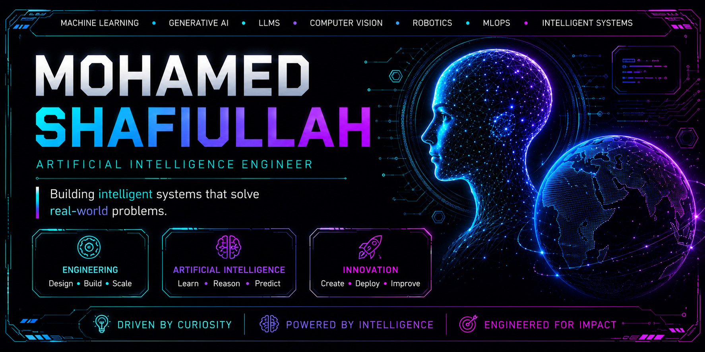

 

# Mohamed Shafiullah

### Artificial Intelligence Engineer

**Machine Learning • Deep Learning • Generative AI • Large Language Models • Computer Vision • Reinforcement Learning • Intelligent Systems • Robotics • MLOps • Software Engineering**

Designing intelligent systems that transform cutting-edge AI research into scalable, production-ready software solutions.

## Engineering Profile

I design, develop, and deploy intelligent software systems that combine Artificial Intelligence, modern software engineering, and scalable infrastructure to solve real-world problems.

My work spans the complete AI engineering lifecycle—from data engineering and model development to deployment, optimization, monitoring, and production-ready AI applications. I focus on building reliable, explainable, secure, and high-performance systems capable of creating measurable business and societal impact.

My technical interests include Artificial Intelligence, Machine Learning, Deep Learning, Generative AI, Computer Vision, Intelligent Systems, Robotics, MLOps, AI Infrastructure, and Software Engineering.
# Engineering Domains

<table>

<tr>

<td width="33%">

### Artificial Intelligence

- Machine Learning
- Deep Learning
- Reinforcement Learning
- Explainable AI (XAI)
- Self-Supervised Learning
- Transfer Learning
- Representation Learning

</td>

<td width="33%">

### Generative AI

- Large Language Models
- Small Language Models
- Agentic AI
- AI Agents
- Retrieval-Augmented Generation
- Prompt Engineering
- Function Calling
- Tool Calling
- Multimodal AI
- Vision-Language Models

</td>

<td width="33%">

### Computer Vision

- Image Processing
- Image Classification
- Object Detection
- Semantic Segmentation
- OCR
- Video Analytics
- Visual Intelligence

</td>

</tr>

<tr>

<td>

### Robotics

- Intelligent Robotics
- Autonomous Systems
- Robot Perception
- Motion Planning
- Sensor Fusion
- Human-Robot Interaction

</td>

<td>

### Intelligent Systems

- Decision Intelligence
- Knowledge-Based Systems
- Intelligent Automation
- Optimization
- AI Decision Systems

</td>

<td>

### Software Engineering

- Backend Engineering
- REST APIs
- Clean Architecture
- System Design
- Scalable Applications

</td>

</tr>

<tr>

<td>

### Data & ML Engineering

- Data Engineering
- Feature Engineering
- Data Pipelines
- Model Evaluation
- Experiment Tracking

</td>

<td>

### MLOps

- Model Deployment
- Model Monitoring
- ML Pipelines
- Docker
- CI/CD
- Version Control

</td>

<td>

### AI Infrastructure

- Edge AI
- Distributed AI
- GPU Computing
- ONNX
- TensorRT
- High-Performance AI

</td>

</tr>

</table>
# Technical Expertise

<table>

<tr>

<td width="50%">

### Programming Languages

- Python
- SQL
- Java
- JavaScript
- HTML5
- CSS3

</td>

<td width="50%">

### AI & Machine Learning

- TensorFlow
- Keras
- Scikit-learn
- XGBoost
- NumPy
- Pandas
- Matplotlib
- OpenCV

</td>

</tr>

<tr>

<td>

### Generative AI

- Large Language Models (LLMs)
- Prompt Engineering
- Retrieval-Augmented Generation (RAG)
- AI Agents
- Function Calling
- Tool Calling
- Vision-Language Models (VLMs)
- Multimodal AI

</td>

<td>

### Deep Learning

- Artificial Neural Networks
- CNNs
- RNNs
- LSTMs
- Transfer Learning
- Model Optimization
- Explainable AI (XAI)

</td>

</tr>

<tr>

<td>

### Backend & APIs

- Flask
- FastAPI
- REST APIs
- SQLite
- MySQL

</td>

<td>

### MLOps & Infrastructure

- Git
- GitHub
- Docker
- Linux
- Model Deployment
- CI/CD
- Experiment Tracking

</td>

</tr>

<tr>

<td>

### Data Engineering

- Data Cleaning
- Data Preprocessing
- Feature Engineering
- Exploratory Data Analysis
- Model Evaluation

</td>

<td>

### Development Tools

- VS Code
- Jupyter Notebook
- Google Colab
- GitHub Actions
- Postman

</td>

</tr>

</table>
# Engineering Capabilities

- Design end-to-end Artificial Intelligence solutions
- Build production-ready Machine Learning systems
- Develop scalable backend architectures for AI applications
- Engineer Computer Vision pipelines for image and video analysis
- Build Large Language Model (LLM) powered applications
- Design AI Agent workflows with external tool integration
- Develop intelligent RESTful APIs and AI microservices
- Train, evaluate, optimize, and deploy Deep Learning models
- Build Explainable AI (XAI) solutions for trustworthy predictions
- Design privacy-aware and secure AI systems
- Integrate AI into enterprise software ecosystems
- Translate research concepts into production-ready applications
- # Industries & Applications

Artificial Intelligence solutions can create value across multiple industries. My engineering interests include:

- Healthcare & Digital Health
- Manufacturing & Industry 4.0
- Robotics & Industrial Automation
- Finance & FinTech
- Cybersecurity
- Smart Cities
- Transportation & Mobility
- Logistics & Supply Chain
- Retail & E-Commerce
- Telecommunications
- Agriculture & Precision Farming
- Energy & Sustainability
- Education Technology
- Aerospace & Defense
- Automotive AI
- Enterprise AI
- Climate Technology
- Government Digital Transformation
- # Research Interests

My long-term interests focus on advancing practical Artificial Intelligence through research, engineering, and real-world deployment.

- Artificial Intelligence
- Machine Learning
- Deep Learning
- Reinforcement Learning
- Generative AI
- Large Language Models (LLMs)
- Agentic AI
- Multimodal AI
- Computer Vision
- Vision-Language Models (VLMs)
- Explainable AI (XAI)
- Federated Learning
- Privacy-Preserving AI
- AI Safety & Responsible AI
- Intelligent Robotics
- Autonomous Systems
- Edge AI
- Distributed AI
- Human-Centered AI
- # Intellectual Property

## PrivacyAuction

**Differentially Private Federated Active Learning Auction System**

**Indian Patent Application**

A privacy-preserving Artificial Intelligence framework that combines Federated Learning, Differential Privacy, Active Learning, and intelligent resource allocation to enable secure collaborative machine learning without centralized data collection.

**Core Research Areas**

- Federated Learning
- Differential Privacy
- Active Learning
- Distributed Artificial Intelligence
- Privacy-Preserving Machine Learning
- # Engineering Philosophy

> Great Artificial Intelligence is not defined by model accuracy alone—it is defined by reliability, scalability, explainability, maintainability, and measurable real-world impact.

I believe successful AI engineering combines strong research foundations with disciplined software engineering to build intelligent systems that are practical, trustworthy, and production-ready.
# Professional Development

Committed to continuous learning through professional certifications, technical literature, engineering practice, open-source collaboration, and emerging research in Artificial Intelligence, Machine Learning, Cloud Technologies, and Modern Software Engineering.
# GitHub Analytics

  

# Connect

<a href="https://github.com/YOUR_USERNAME">GitHub</a> •
<a href="https://www.linkedin.com/in/YOUR_LINKEDIN">LinkedIn</a> •
<a href="YOUR_PORTFOLIO_URL">Portfolio</a> •
<a href="mailto:YOUR_EMAIL">Email</a>

---

### Building Intelligent Systems for Real-World Impact

*Engineering Artificial Intelligence that is practical, scalable, explainable, and production-ready.*

