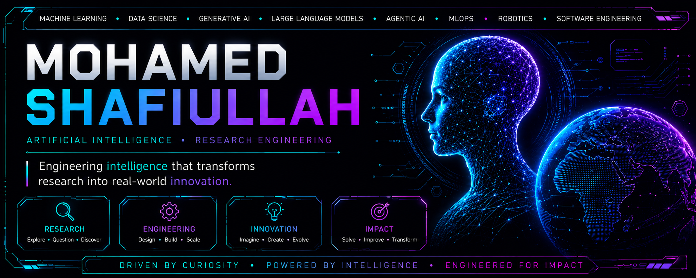

 

  

---

# Mohamed Shafiullah

### Artificial Intelligence • Research Engineering

> *Engineering intelligence that transforms research into real-world innovation.*

---

## Mission

I engineer intelligent systems that bridge scientific research and real-world applications through Artificial Intelligence, Machine Learning, Data Science, Generative AI, and Software Engineering.

My goal is to build reliable, scalable, and responsible AI technologies that create measurable impact across industries while advancing the future of intelligent systems.

---

## Current Exploration

- Foundation Models & Large Language Models
- AI Agents & Autonomous Systems
- Intelligent Decision Support Systems
- Machine Learning & Deep Learning
- Explainable & Responsible AI
- Computer Vision
- Natural Language Processing
- Data Science & Advanced Analytics
- MLOps & AI Deployment
- Robotics & Intelligent Automation

---

## Research Interests

- Artificial Intelligence
- Machine Learning
- Deep Learning
- Generative AI
- Large Language Models
- Agentic AI
- Explainable AI (XAI)
- Responsible AI
- Human-AI Collaboration
- Intelligent Decision Systems
- AI for Healthcare
- Intelligent Robotics

---

## Engineering Ecosystem

### Languages

Python • Java • C++ • JavaScript • TypeScript • SQL

### AI & Machine Learning

PyTorch • TensorFlow • Scikit-learn • XGBoost • LightGBM

### Generative AI

Transformers • Hugging Face • LangChain • LlamaIndex • FAISS • Ollama • vLLM • OpenAI API • Prompt Engineering • Retrieval-Augmented Generation (RAG)

### Backend Engineering

FastAPI • Flask • Node.js • REST APIs • GraphQL • WebSockets

### Data Science

Pandas • NumPy • SciPy • Matplotlib • Seaborn

### MLOps

Docker • Kubernetes • MLflow • DVC • Weights & Biases • ONNX • Airflow • GitHub Actions

### Databases

PostgreSQL • MySQL • MongoDB • Redis • Firebase

### Cloud & Infrastructure

AWS • Microsoft Azure • Google Cloud • Linux • Git

---

## Featured Work

> Premium AI projects, research systems, and intelligent products are currently being refined and will be published here.

---

## Philosophy

- Research before assumptions.
- Engineering with purpose.
- Build systems that scale.
- Design AI responsibly.
- Solve real-world problems.
- Never stop learning.

---

## Vision

I believe the next generation of software will not simply execute instructions—it will reason, learn, collaborate, and continuously improve.

My ambition is to contribute to that future by designing intelligent systems that combine rigorous research, thoughtful engineering, and practical innovation.

---

## Beyond Code

Technology becomes meaningful when it empowers people.

I strive to build systems that are not only intelligent, but also trustworthy, explainable, and impactful.

---

### *Driven by Curiosity • Powered by Intelligence • Engineered for Impact*

